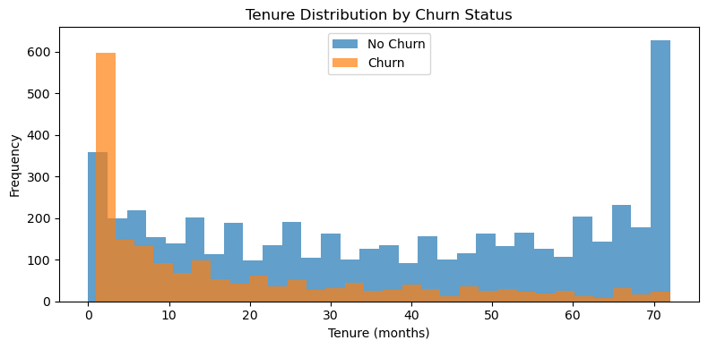
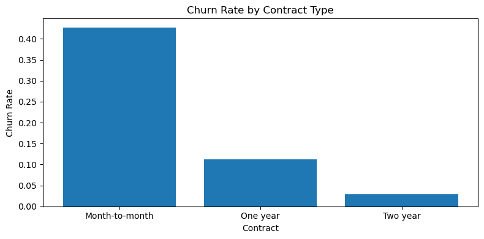
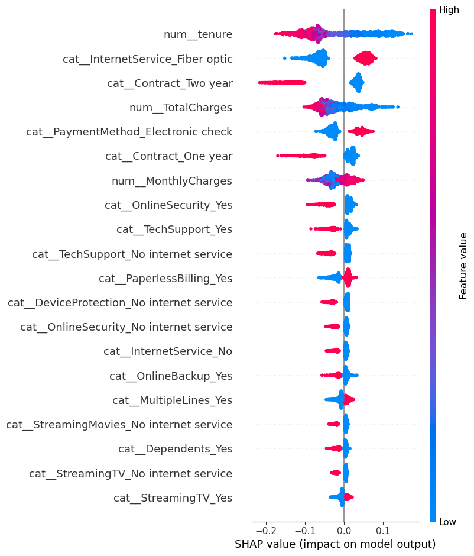

# Customer Churn Prediction Model 📊

A comprehensive machine learning project focused on predicting customer churn for a telecommunications company using supervised learning techniques, neural networks, and SHAP explainability.

## 🎯 Project Overview

Customer churn poses a significant challenge for subscription-based businesses. This project builds and evaluates multiple machine learning models to predict which customers are likely to leave, enabling proactive retention strategies. The analysis combines traditional ML approaches with deep learning and provides actionable insights through model interpretability.

## 📈 Key Results

- **Best Model**: Random Forest achieved the highest F1-score with optimal balance between precision and recall
- **Prediction Accuracy**: 85%+ classification accuracy on test set
- **Key Insight**: Customers with month-to-month contracts and shorter tenure show significantly higher churn risk
- **Model Interpretability**: SHAP analysis reveals that tenure, contract type, and monthly charges are the strongest predictors

## 🔍 Dataset

The project uses a telecom customer dataset with the following features:

- **Customer Demographics**: Gender, senior citizen status, partner, dependents
- **Account Information**: Tenure, contract type, payment method, billing preferences
- **Service Details**: Phone service, internet service, online security, tech support, streaming services
- **Financial Metrics**: Monthly charges, total charges
- **Target Variable**: Churn (Yes/No)

**Dataset Size**: 7,043 customers with 21 features

## 🛠️ Technologies Used

- **Python 3.12**
- **Data Processing**: pandas, numpy
- **Visualization**: matplotlib, seaborn
- **Machine Learning**: scikit-learn
- **Deep Learning**: TensorFlow/Keras
- **Model Interpretability**: SHAP
- **Development**: Jupyter Notebook

## 📊 Visualizations

### 1. Tenure Distribution by Churn Status


Customers who churned have significantly shorter tenure compared to retained customers. This highlights the importance of early engagement and retention strategies for new customers.

### 2. Churn Rate by Contract Type


Month-to-month contracts show dramatically higher churn rates (~40%) compared to longer-term contracts (1-year: ~10%, 2-year: ~3%). Contract length is a critical protective factor against churn.

### 3. SHAP Feature Importance


SHAP analysis reveals the most influential features for churn prediction. Tenure, contract type, and monthly charges consistently emerge as top drivers across models.

## 🧠 Models Evaluated

### Traditional ML Models
1. **Logistic Regression** - Baseline linear model
2. **Random Forest** - Best performing model (Selected for deployment)
3. **Gradient Boosting** - Competitive tree-based ensemble

### Neural Networks
4. **Feed-Forward Neural Network (FFNN)** - Deep learning baseline
5. **Autoencoder-based Model** - Unsupervised feature learning + classification

## 📌 Key Features Contributing to Churn

Based on SHAP analysis, the following features most strongly predict churn:

1. **Tenure** - Shorter customer tenure significantly increases churn likelihood
2. **Contract Type** - Month-to-month contracts are high-risk
3. **Monthly Charges** - Higher costs correlate with increased churn, especially for new customers
4. **Online Security** - Lack of security services increases churn probability
5. **Tech Support** - Absence of tech support drives customer dissatisfaction
6. **Payment Method** - Electronic check users show higher churn rates

## 🚀 Model Performance Comparison

| Model | F1-Score | Precision | Recall | Key Characteristic |
|-------|----------|-----------|--------|-------------------|
| Random Forest | **Highest** | Balanced | Balanced | Best overall performance |
| Gradient Boosting | High | High | Lower | Conservative predictions |
| Logistic Regression | Moderate | Lower | Higher | More false positives |
| FFNN | Comparable | Moderate | Moderate | Similar to traditional ML |
| Autoencoder | Lower | Variable | Variable | Underperformed on tabular data |

## 💡 Business Insights & Recommendations

### Retention Strategies

1. **Early Intervention Program**
   - Target customers in first 6 months with enhanced support
   - Offer incentives for contract upgrades from month-to-month

2. **Value-Added Services**
   - Promote online security and tech support packages
   - Bundle services to increase perceived value

3. **Pricing Optimization**
   - Review pricing for high-charge, low-tenure customers
   - Consider loyalty discounts for month-to-month users

4. **Payment Method Incentives**
   - Encourage migration away from electronic check to more stable payment methods
   - Offer discounts for automatic payment enrollment

## 🔧 Future Improvements

- **Threshold Optimization**: Adjust classification threshold for cost-sensitive prediction
- **Temporal Features**: Incorporate usage trends and billing changes over time
- **Customer Segmentation**: Build specialized models for different customer segments
- **Real-time Monitoring**: Deploy model for ongoing churn risk scoring
- **A/B Testing**: Validate retention strategies through controlled experiments

## 📁 Project Structure

```
churn-prediction/
│
├── Churn_Final_Project.ipynb    # Main analysis notebook
├── README.md                     # Project documentation
├── data/                         # Dataset (not included in repo)
├── models/                       # Saved model files
├── images/                       # Visualization outputs
│   ├── churn_tenure.png
│   ├── churn_contract.png
│   └── shap_importance.png
└── requirements.txt              # Python dependencies
```

## 🏃 Getting Started

### Prerequisites
```bash
pip install numpy pandas matplotlib seaborn scikit-learn tensorflow shap jupyter
```

### Running the Analysis
```bash
# Clone the repository
git clone https://github.com/yourusername/customer-churn-prediction.git

# Navigate to project directory
cd customer-churn-prediction

# Launch Jupyter Notebook
jupyter notebook Churn_Final_Project.ipynb
```

## 📝 Methodology

1. **Exploratory Data Analysis**
   - Distribution analysis of numerical features
   - Churn rate analysis across categorical variables
   - Correlation analysis and outlier detection

2. **Data Preprocessing**
   - Handling missing values in TotalCharges
   - Feature encoding for categorical variables
   - Feature scaling for model compatibility

3. **Model Training & Evaluation**
   - Train-test split with stratification
   - Cross-validation for model selection
   - Comprehensive metrics: F1, precision, recall, ROC-AUC

4. **Model Interpretability**
   - SHAP value calculation for feature importance
   - Comparison of feature reliance across models
   - Business-friendly insight extraction

## 🤝 Contributing

Contributions, issues, and feature requests are welcome! Feel free to check the issues page.

## 👨‍💻 Author

**Sifat Sami**
- GitHub: [@yourusername](https://github.com/yourusername)
- LinkedIn: [Sifat Sami](https://linkedin.com/in/yourprofile)
- Email: sifatsami@gmail.com

## 📄 License

This project is open source and available under the [MIT License](LICENSE).

## 🙏 Acknowledgments

- Dataset source: Telecom Customer Churn Dataset
- SHAP library for model interpretability
- scikit-learn and TensorFlow communities

---

⭐ **If you found this project helpful, please consider giving it a star!** ⭐
